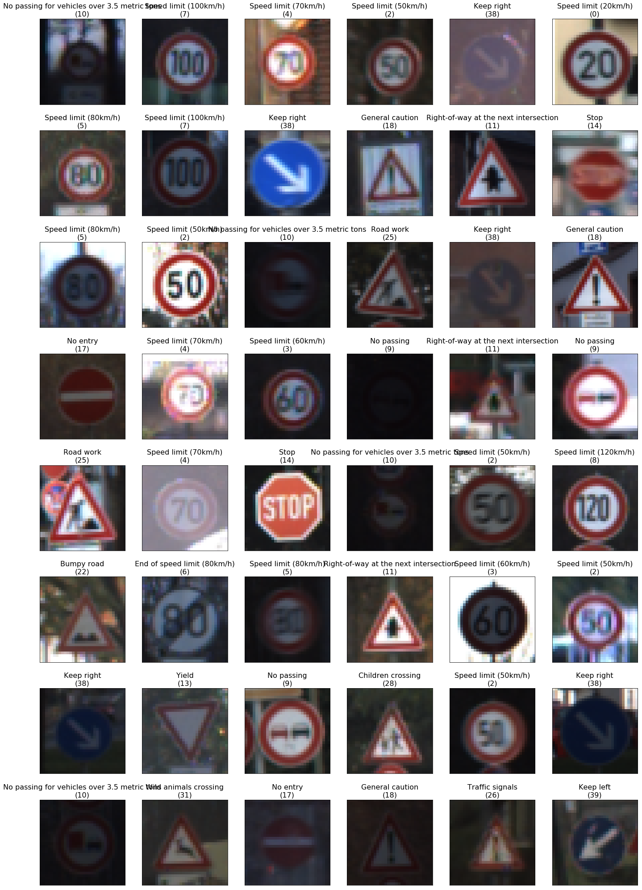
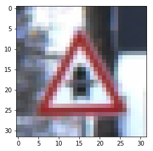
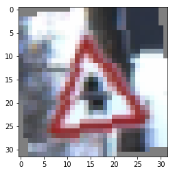
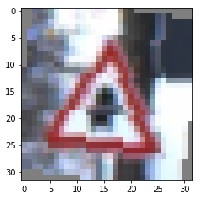
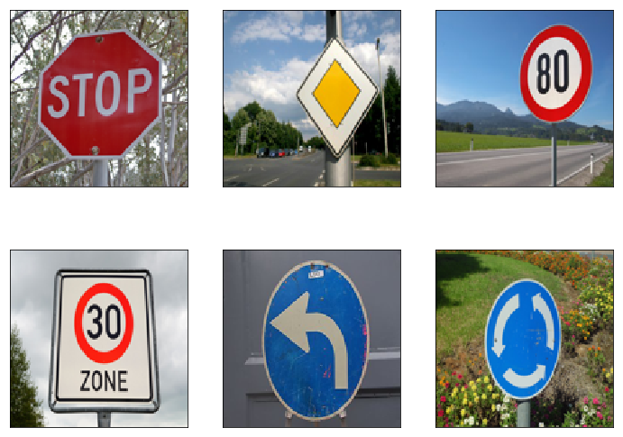
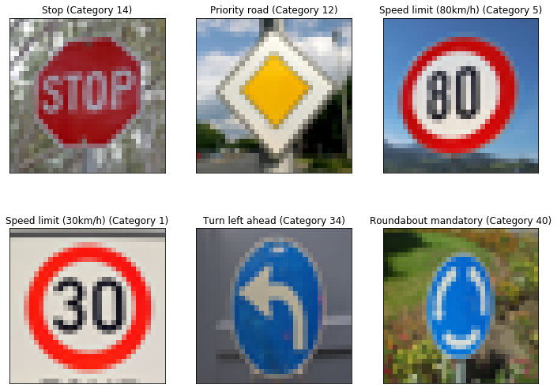
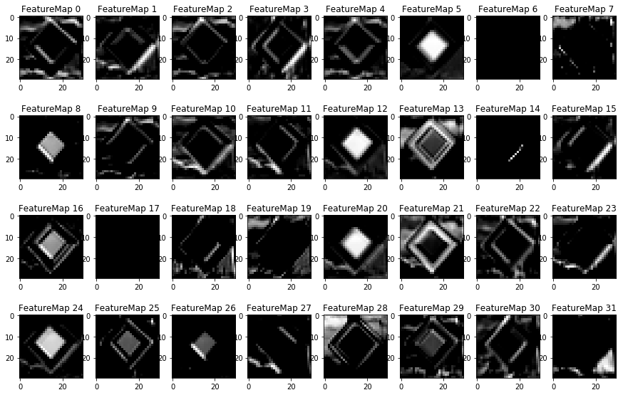
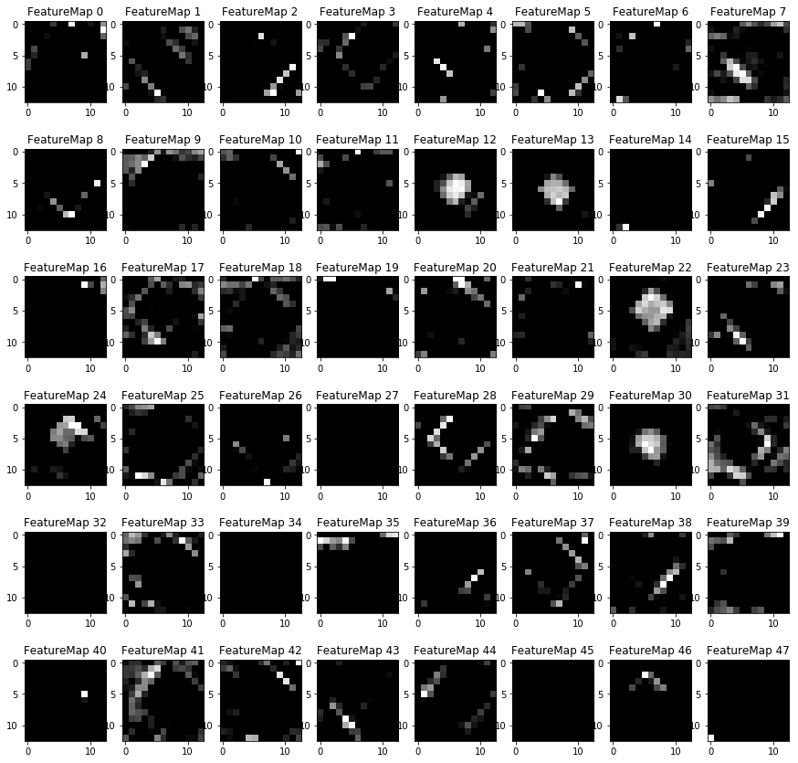
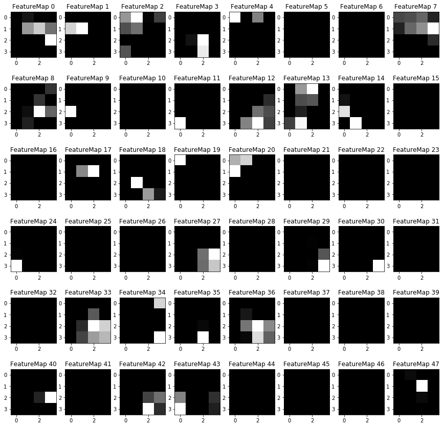

# **Traffic Sign Recognition** 

## Writeup

---

**Build a Traffic Sign Recognition Project**

The goals / steps of this project are the following:

* Load the data set (see below for links to the project data set)
* Explore, summarize and visualize the data set
* Design, train and test a model architecture
* Use the model to make predictions on new images
* Analyze the softmax probabilities of the new images
* Summarize the results with a written report

[//]: # (Image References)

[image1]: ./examples/visualization.jpg "Visualization"
[image2]: ./examples/grayscale.jpg "Grayscaling"
[image3]: ./examples/random_noise.jpg "Random Noise"
[image4]: ./examples/placeholder.png "Traffic Sign 1"
[image5]: ./examples/placeholder.png "Traffic Sign 2"
[image6]: ./examples/placeholder.png "Traffic Sign 3"
[image7]: ./examples/placeholder.png "Traffic Sign 4"
[image8]: ./examples/placeholder.png "Traffic Sign 5"

## Rubric Points
### Here I will consider the [rubric points](https://review.udacity.com/#!/rubrics/481/view) individually and describe how I addressed each point in my implementation.  

---
### Writeup / README

This is Michael Ikemann's writeup of the second project of the Self-Driving Car Engineer Nanodegree program.

Here you can find the project's source code:
[project code](Traffic_Sign_Classifier.ipynb)

### Data Set Summary & Exploration

#### 1. Provide a basic summary of the data set. In the code, the analysis should be done using python, numpy and/or pandas methods rather than hardcoding results manually.

As proposed I used the pandas library to calculate summary statistics of the traffic signs data set:

* There are 43799 training images. With the help of these images the neural network will be trained/fit to what it shall detect later.
* The size of the validation set is 4410. This is set is being used to show the current accuracy of the predictions within the training process.
* The size of test set is 12630. These are used at the end to verify how well the detections works on a dataset the neural network has never seen before.
* The shape of a traffic sign image is 32x32 pixels and using 3 color channels (RGB)
* The number of unique classes/labels in the data set is 43.

Here you can find a list of all provided traffic sign types (value below minus one is the internal id):

1. Speed limit (20km/h)
2. Speed limit (30km/h)
3. Speed limit (50km/h)
4. Speed limit (60km/h)
5. Speed limit (70km/h)
6. Speed limit (80km/h)
7. End of speed limit (80km/h)
8. Speed limit (100km/h)
9. Speed limit (120km/h)
10. No passing
11. No passing for vehicles over 3.5 metric tons
12. Right-of-way at the next intersection
13. Priority road
14. Yield
15. Stop
16. No vehicles
17. Vehicles over 3.5 metric tons prohibited
18. No entry
19. General caution
20. Dangerous curve to the left
21. Dangerous curve to the right
22. Double curve
23. Bumpy road
24. Slippery road
25. Road narrows on the right
26. Road work
27. Traffic signals
28. Pedestrians
29. Children crossing
30. Bicycles crossing
31. Beware of ice/snow
32. Wild animals crossing
33. End of all speed and passing limits
34. Turn right ahead
35. Turn left ahead
36. Ahead only
37. Go straight or right
38. Go straight or left
39. Keep right
40. Keep left
41. Roundabout mandatory
42. End of no passing
43. End of no passing by vehicles over 3.5 metric tons

#### 2. Include an exploratory visualization of the dataset.

Below you can see an overview of 48 randomly chosen images of the set provided. As you can see many images of the same class vary heavily in brightness, sharpness and position within the image and sometimes (like in the 3rd column of the 3rd row) are nearly not visible at all, even for a human.

### Design and Test a Model Architecture

#### 1. Describe how you preprocessed the image data. What techniques were chosen and why did you choose these techniques? Consider including images showing the output of each preprocessing technique. Pre-processing refers to techniques such as converting to grayscale, normalization, etc. (OPTIONAL: As described in the "Stand Out Suggestions" part of the rubric, if you generated additional data for training, describe why you decided to generate additional data, how you generated the data, and provide example images of the additional data. Then describe the characteristics of the augmented training set like number of images in the set, number of images for each class, etc.)

I decided to keep the color channels intact as at least for me as human the color component seems pretty important to quickly distinguish one image from the other. Instead I tried to create as many colored variations of the about 44,000 images provided and augmented them to overall about 240,000 images by varying theirs brightness and slightly rotating each of them by 8 degree counter clockwise and 8 degree clockwise.

As neural networks in general converge better and faster when normalized data is provided I rescaled theirs color channels to a range from -1 to +1.

#### 2. Describe what your final model architecture looks like including model type, layers, layer sizes, connectivity, etc.) Consider including a diagram and/or table describing the final model.

My final model consisted of the following layers:

| Layer         		|     Description	        					| 
|:---------------------:|:---------------------------------------------:| 
| Input         		| 32x32x3 RGB image   							| 
| Convolution 3x3     	| 1x1 stride, valid padding, outputs 30x30x32 	|
| RELU					| Normalize all values back to max(0,value) (clip negative values)												|
| Max pooling	      	| 2x2 stride,  outputs 15x15x32				|
| Convolution 3x3     	| 1x1 stride, valid padding, outputs 13x13x64	|
| RELU					| Normalize all values back to max(0,value) (clip negative values)												|
| Max pooling	      	| 2x2 stride,  outputs 6x6x64				|
| Convolution 3x3     	| 1x1 stride, valid padding, outputs 4x4x128	|
| RELU					| Normalize all values back to max(0,value) (clip negative values)											|
| Max pooling	      	| 2x2 stride,  outputs 2x2x128
| Fully connected		| 2x2x128 -> 512	
| Fully connected		| 512 -> 800	
| Fully connected		| 800 -> 400
| Fully connected		| 400 -> 43
| Softmax				| Predict to the most dominant of the 43 traffic sign classes 

I based it upon the idea of the previous exercices using LeNet and extended the count of filters and layers to enable it to detect more complex variations.

Below you can see the original idea.

#### 3. Describe how you trained your model. The discussion can include the type of optimizer, the batch size, number of epochs and any hyperparameters such as learning rate.

I trained the model using the softmax cross entropy function in combination with reduce_mean and using the adam (Adaptive Moment Estimation) optimizer, which uses an adaptive momentum to prevent getting stuck in local minima. This combination provided the best results in previous experiments using categorizable, one-hot encoded data.

More details about the softmax function, cross entropy and adam you can find here:

[https://en.wikipedia.org/wiki/Softmax_function](https://en.wikipedia.org/wiki/Softmax_function)

[https://en.wikipedia.org/wiki/Cross_entropy](https://en.wikipedia.org/wiki/Cross_entropy)

[https://en.wikipedia.org/wiki/Stochastic_gradient_descent](https://en.wikipedia.org/wiki/Stochastic_gradient_descent)

####My other hyperparamters were:

* 10 epochs
* A batch size of 128 images
* A sigma of 0.1 for the weight initializations
* A learning rate of 0.001

I tried different batches sizes, epoch counts and slightly varied the learning rate, but the values above resulted in the best overall performance.

#### 4. Describe the approach taken for finding a solution and getting the validation set accuracy to be at least 0.93. Include in the discussion the results on the training, validation and test sets and where in the code these were calculated. Your approach may have been an iterative process, in which case, outline the steps you took to get to the final solution and why you chose those steps. Perhaps your solution involved an already well known implementation or architecture. In this case, discuss why you think the architecture is suitable for the current problem.

####My final model results were:

* training set accuracy of 96.4%
* validation set accuracy of 95.9%
* test set accuracy of 93.9%

If an iterative approach was chosen:

* What was the first architecture that was tried and why was it chosen?

In the first try I used the original LeNet structure and just slightly it's count of feature maps.

* What were some problems with the initial architecture?

I think one of the major issues was the overall too small complexity of the network considering the far more complex and far stronger varying input images with several different lighting, rotation and sharpness.

* How was the architecture adjusted and why was it adjusted? Typical adjustments could include choosing a different model architecture, adding or taking away layers (pooling, dropout, convolution, etc), using an activation function or changing the activation function. One common justification for adjusting an architecture would be due to overfitting or underfitting. A high accuracy on the training set but low accuracy on the validation set indicates over fitting; a low accuracy on both sets indicates under fitting.

* Which parameters were tuned? How were they adjusted and why?

The network was heavily underfitting so I first of all dramatically increased the features maps from 120 to 512 and insertied an aditional convolutional layers to allow more complex combinations of single features.

The final setup was 32x32x3 -> 30x30x32 -> 15x15x32 -> 13x13x64 -> 6x6x64 -> 4x4x128 -> 2x2x128
The 128 feature maps of the last stage are then flattended to a full connected layer with 512 nodes.

* What are some of the important design choices and why were they chosen? For example, why might a convolution layer work well with this problem? How might a dropout layer help with creating a successful model?

The major reason for convolutonal network is feature sharing and to keep the count of connections low. A filter which is in our case for example used to detect the round upper left curve of a speed limit sign works pretty well if this curve is placed at position 5x8 as well as if this would be placed at 12x12. If within the trainig process a feature such as this proofs to be "useful" then it can be used and trained by all areas of the image.

In difference to this a fully connected layer would just be able to detect such a curve if it it were at nearly exactly same position and another image,  decreasing the training process and making it far less tolerant.

### Test a Model on New Images

#### 1. Choose five German traffic signs found on the web and provide them in the report. For each image, discuss what quality or qualities might be difficult to classify.

Here are six German traffic signs that I found on the web:

The third was before the optimization of the network pretty easily mistaken for a speedlimit of 30 and the fact that it's slidely rotated away from the camera view likely still increased this effect.

#### 2. Discuss the model's predictions on these new traffic signs and compare the results to predicting on the test set. At a minimum, discuss what the predictions were, the accuracy on these new predictions, and compare the accuracy to the accuracy on the test set (OPTIONAL: Discuss the results in more detail as described in the "Stand Out Suggestions" part of the rubric).

Here are the results of the prediction:

The model was able to detect all 6 of the 6 images. To make this possible I though needed to crop the images and remove excessive border to make the look similar to the original training set.

#### 3. Describe how certain the model is when predicting on each of the five new images by looking at the softmax probabilities for each prediction. Provide the top 5 softmax probabilities for each image along with the sign type of each probability. (OPTIONAL: as described in the "Stand Out Suggestions" part of the rubric, visualizations can also be provided such as bar charts)

* Image 1 (stop sign)

  Correctly classified image at index 0. Predicted: Stop - Correct: Stop
TopKV2(values=array([[1.0000000e+00, 1.5428418e-19, 1.1768161e-20, 2.4279877e-21,
        1.1799261e-21]], dtype=float32), indices=array([[14, 29,  3,  0,  5]], dtype=int32))
        
  For the first image the classifier is 100% sure that a stop sign was detected. It's huge red area and octagonal shape very likely makes it stand out a lot.
  All other 4 probabilities were basically close to zero: Bicycle, Speed limit 60, Speed limit 20, Speed limit 80. The 3 red signs are not really surprising, the bicycle crossing does though.

* Image 2 (priority road)

  Correctly classified image at index 1. Predicted: Priority road - Correct: Priority road
TopKV2(values=array([[1., 0., 0., 0., 0.]], dtype=float32), indices=array([[12,  0,  1,  2,  3]], dtype=int32))

  As for the first image this one is as well 100% sure that it correctly detected a priority road, not really surprising as this fried egg yellow white combo is quite unique.
   All 4 other possibilities are as well nearly zero after applying softmax: Speed limit 20, Speed limit 30, Speed limit 50, Speed limit 60. I would claim the top_n algorithm chosen to select the 5 most likely signs simply decided here to fill up the array with the first occuring, other numbers.

* Image 3 (Speed limit 80 km/h)
  
  Correctly classified image at index 2. Predicted: Speed limit (80km/h) - Correct: Speed limit (80km/h)
TopKV2(values=array([[9.1581070e-01, 7.0445254e-02, 1.3488248e-02, 2.4162568e-04,
        1.4149245e-05]], dtype=float32), indices=array([[5, 7, 8, 2, 1]], dtype=int32))
        
  Here the algorithm slowly becomes a bit nervous and is just still 91.5% sure that he correctly detected the 80 km/h speed limit. On the one hand the image is slightly rotated, on the other hand there are many images which look quite similar. With a certainy of at least still 7% he guesses that it could be a 100 km/h speed limit, with a certainty of 1.3% that it would be a 120 km/h speed limit, with at least still 0.0002% that it's a 50 km/h speed limit and last but not least with a certainty of 0.000014% that it's a 30 km/h speed limit. I am a bit surprised that the 30 km/h limit was the last of the 4 others as it does look so similar.

* Image 4 (Speed limit 30 km/h)
  
  Correctly classified image at index 3. Predicted: Speed limit (30km/h) - Correct: Speed limit (30km/h)
TopKV2(values=array([[1.0000000e+00, 3.7644343e-34, 2.4543721e-34, 2.1053001e-36,
        7.1921885e-38]], dtype=float32), indices=array([[1, 0, 2, 8, 4]], dtype=int32))

  Here once again the algorithm was 100% sure that a speed limit of 30 km/h is detected. As the lighting and rotation of this example is perfectly matching the training set this is not really surprising. All other 4 images have a probability of close to zero, these are (not really surprising) Speed limit 20 km/h, Speed limit 50 km/h, Speed limit 120 km/h and speed limit 70 km/h.

* Image 5 (Turn left ahead)

  Correctly classified image at index 4. Predicted: Turn left ahead - Correct: Turn left ahead
TopKV2(values=array([[1.0000000e+00, 6.8599010e-31, 6.4796716e-33, 7.5305240e-34,
        1.5227687e-34]], dtype=float32), indices=array([[34, 12, 38, 26, 13]], dtype=int32))

  The fifth image was also detected correctly and it was pretty sure it was right with a probability of close to 100%. With a probability of nearly zero it predicted Priority road, Go straight or right, Traffic signals and Yield.

* Image 6 (Roundabout)

  Correctly classified image at index 5. Predicted: Roundabout mandatory - Correct: Roundabout mandatory
TopKV2(values=array([[9.9881786e-01, 1.0787412e-03, 4.3544285e-05, 1.9011535e-05,
        1.4707644e-05]], dtype=float32), indices=array([[40,  1, 38, 11, 42]], dtype=int32))

  Not as sure as in all the other cases it detected the round about with a probability of 99.8%, right followed by a probability of 0.001% it could be a 30 km/h speed limit and with a probability of around .00005 it could be a Keep right, Right-of-way or End of no passing > 3.5 tons sign.

### (Optional) Visualizing the Neural Network (See Step 4 of the Ipython notebook for more details)

####Features map of the priority road activations:

**Layer 1**

**Layer 2**

**Layer 3**

#### 1. Discuss the visual output of your trained network's feature maps. What characteristics did the neural network use to make classifications?

The neural network tries to combine the features layer by layer to then after the final layer being able to guess which combinations of features might form which traffic sign.

In the first layer you can see pretty well that the final features are a mix of features activating when the area is quite one colored and many others which just activate in case of special gradients and build some sort of sobel filter.

In the second layer only still perfectly fitting pattenrs are still activated such as diagonal lines at the edges.

And last but not least the 3rd layer tried to find the unique combinations of these filters.

