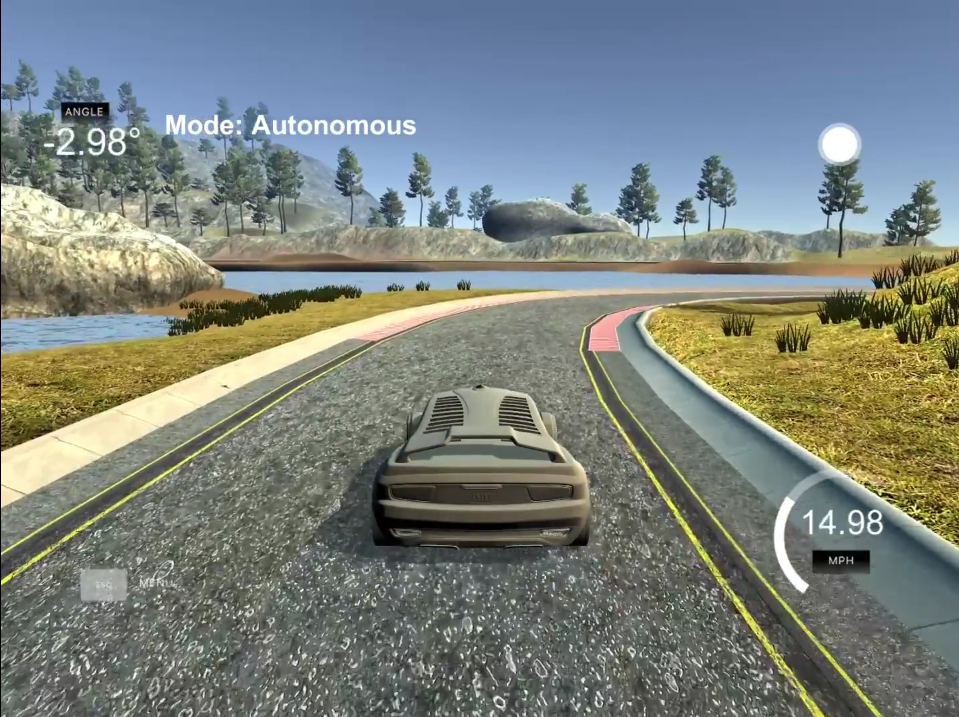
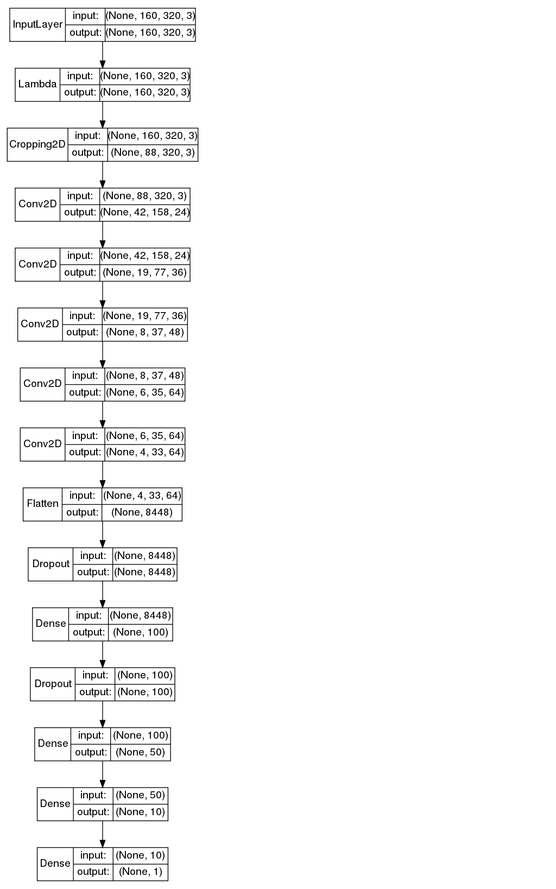
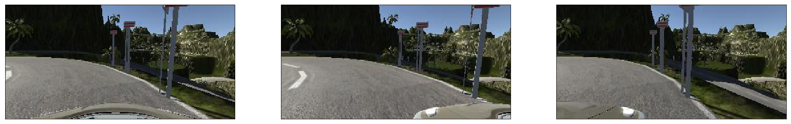

# **Behavioral Cloning** 



**Behavioral Cloning Project**

The goals / steps of this project are the following:

* Use the simulator to collect data of good driving behavior
* Build, a convolution neural network in Keras that predicts steering angles from images
* Train and validate the model with a training and validation set
* Test that the model successfully drives around track one without leaving the road
* Summarize the results with a written report

## Rubric Points
### Here I will consider the [rubric points](https://review.udacity.com/#!/rubrics/432/view) individually and describe how I addressed each point in my implementation.  

---
### Files Submitted & Code Quality

#### 1. Submission includes all required files and can be used to run the simulator in autonomous mode

My project includes the following files:

* [CloneBehavior.ipynb](CloneBehavior.ipynb) containing the Jupyter Notebook which trained the model for me on an AWS instance
* [CloneBehavior.html](CloneBehavior.html) An html version of the Jupyter notebook
* model.py, an exported version of CloneBehavior.ipynb
* drive.py for driving the car in autonomous mode
* model_track1.h5 containing a trained convolution neural network for track 1
* model_track2.h5 containing a trained convolution neural network for track 2
* writeup_report.md - The file you are reading right now describing the solution steps of this project
* video.mp4 / [https://youtu.be/Dx1JrIlXiDM](https://youtu.be/Dx1JrIlXiDM) showing a video of track 1
* video_track2.mp4 / [https://youtu.be/z9thy7knTAg](https://youtu.be/z9thy7knTAg) showing a video of track 2

Note: You can also find all files at [https://github.com/Alyxion/Udacity_SelfDrivingCarEngineerNd/tree/master/1_14_Project_3_Behavioral_Cloning](https://github.com/Alyxion/Udacity_SelfDrivingCarEngineerNd/tree/master/1_14_Project_3_Behavioral_Cloning)

#### 2. Submission includes functional code
Using the Udacity provided simulator and my drive.py file, the car can be driven autonomously around the track by executing 
```sh
python drive.py model_track1.h5
```
for track one and
```sh
python drive.py model_track2.h5
```
for track two.

#### 3. Submission code is usable and readable

The [CloneBehavior.ipynb](CloneBehavior.ipynb) file contains the code for training and saving the convolution neural network. The file shows the pipeline I used for training and validating the model, and it contains comments to explain how the code works.

### Model Architecture and Training Strategy

#### 1. An appropriate model architecture has been employed

My model is based upon nVidia's Deep Learning for Self-Driving Cars end to end network published in 2016 in theirs blog: [https://devblogs.nvidia.com/deep-learning-self-driving-cars/](https://devblogs.nvidia.com/deep-learning-self-driving-cars/)

It consists of 8 layers, 5 convolutional layers with relu activation, there of the first three using a 5x5 kernel and the other two a 3x3 kernel. The outputs of the final layer flattened layer consisting of 8448 neurons is then evaluated by 3 fully connected layers with a size of 100, 50 and 10 neurons to predict the final outcome of the optimal steering angle in the current situation.



#### 2. Attempts to reduce overfitting in the model

The model contains dropout after two layers in order to reduce overfitting right after flattening the outcome of the convolutional layers and the first full connected one.

The model was trained and validated on different data sets of at least 6 laps per track to prevent overfitting.
All images have also been mirrored to prevent left or right steering preferences / overfitting.

#### 3. Model parameter tuning

The model used an adam optimizer, so the learning rate was not tuned manually.

#### 4. Appropriate training data

I recorded several different driving style sessions to keep the vehicle on the track. After my first attemps the vehicle stood perfectly in the center of the road, but did not know how to act when it got close to the border of the street. After this problem was solved it did not know how to behave on the bridge in a similar situation so I added special bridge sessions to remove this issue.

It's important that the driver who created the training data "experiences" all situations to which the vehicle shall later be able to react appropriately.

I also augmented the data by mirroring each image and the steering direction along the horizontal axis and by including the images recorded by the left and right side cameras.



### Model Architecture and Training Strategy

#### 1. Solution Design Approach

The overall strategy for deriving a model architecture was to design an end to end system which is (effectively) able to detect the border markings and the middle of the road using multiple convolutional layers, but instead to categorize theirs outcome or to detect an object it instead transforms the activations of the single filters into the corresponding steering value.

I tried multiple approaches with different count and widths of layers, but the nVidia setup shown above proofed to deliver the best results. I added a dropout rate of 25% after the flattening of the convolutional layers and the first fully connected layer which helped against exaggerated steering behavior in some situations caused by overfitting.

The vehicle drove pretty well on the most parts of the track very quickly but had some misbehavior on the bridge and close to the sand bed so I recorded these parts and how to behave there some more times which solved the problem.

#### 2. Final Model Architecture

The final model architecture consisted of following layers:

* 5x5 kernel covolution with relu activation, stepsize of 2
* 5x5 kernel covolution with relu activation, stepsize of 2
* 5x5 kernel covolution with relu activation, stepsize of 2
* 3x3 kernel covolution with relu activation, stepsize of 1
* 3x3 kernel covolution with relu activation, stepsize of 1
* Flattend data layer with a size of 8448 neurons and with a dropout rate of 25%
* Fully connected layer consisting of 100 neurons with a size of 1164 and with a dropout rate of 25%
* Fully connected layer using 50 neurons
* Fully connected layer using 10 neurons
* The output value (steering angle)

Here is a visualization of the architecture:


#### 3. Creation of the Training Set & Training Process

I created overall 10 training sessions, 7 medium sized ones for track one and three huge ones with 2-3 laps each for track two.

As already pointed out it was cruicial to let the neural network experience several situations like steep curves, getting very close the the boundaries for more intensive maneuvers or staying close to the cenrer line.

I started with 4 sessions and added the other ones step by step when I discovered weaknesses in the driving behavior at bridges, very steep curves or special, rare points such as heavily shadows areas in track 2.

After the preparation of training data for all situations I trained the network twice, once for track 1 and once for track 2.

After each training process I downloaded it from AWS and use the provided drive.py script to host a local PID server.

Then I connected the simulator to this local server and the vehicle successfully passed both tracks:

### Track 1:
[https://youtu.be/Dx1JrIlXiDM](https://youtu.be/Dx1JrIlXiDM)

### Track 2:
[https://youtu.be/z9thy7knTAg](https://youtu.be/z9thy7knTAg)
