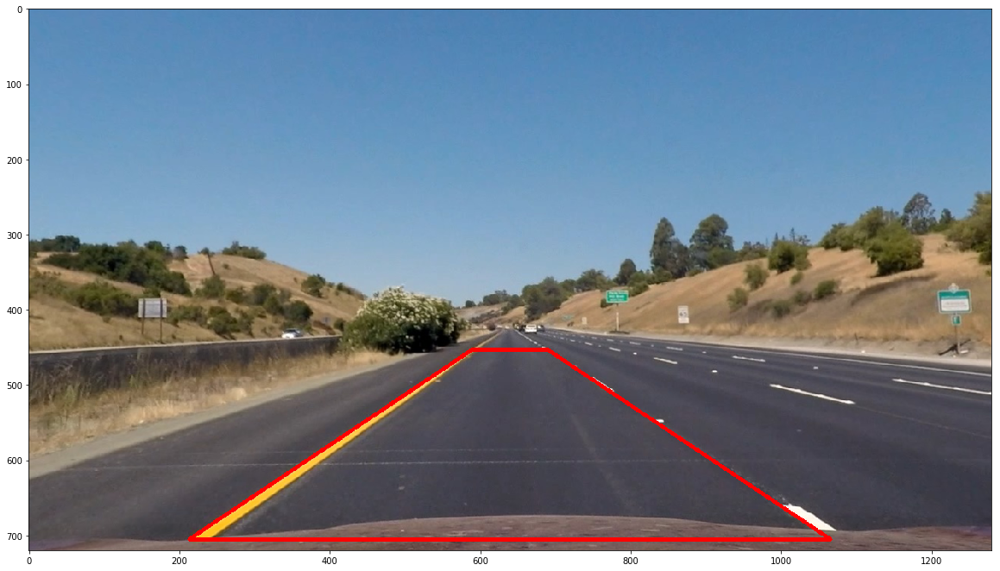

# Advanced Lane Detection
#### Project 4 of Udacity's Self-Driving Car Engineer Nanodegree


**The goals / steps of this project are the following:**

* Compute the camera calibration matrix and distortion coefficients given a set of chessboard images.
* Apply a distortion correction to raw images.
* Use color transforms, gradients, etc., to create a thresholded binary image.
* Apply a perspective transform to rectify binary image ("birds-eye view").
* Detect lane pixels and fit to find the lane boundary.
* Determine the curvature of the lane and vehicle position with respect to center.
* Warp the detected lane boundaries back onto the original image.
* Output visual display of the lane boundaries and numerical estimation of lane curvature and vehicle position.

## File overview

###The following files are part of this submission:

**Source files:**

* AdvLaneCamera.py - Contains the class AdvCamera which is responsible for the camera calibration process and the distortion correction
* AdvLanePerspectiveTransform.py - Contains the class LanePerspectiveTransform which setups the transformation matrices and provides the functions to transform the area of interest from the perspectival view to a top view and results back to a perspectival view.
* AdvLaneHelper.py - Just a small helper class, for example to load and undistort the example images and convert them directly to RGB.
* AdvLaneThresher.py - Beware of the evil thresher ;). The class AdvLaneThresher applies several filters to the perspectival variant of the input picture to mask pixels which are very likely part of the lanes.
* AdvLaneVideoCreator - Contains the functions to convert the final result video, a top view highlighting the detected pixels and a top view of the street with highlighted, dominant detection windows
* CreateVideos.py - Calling this file will automatically create all three videos attached to this submission
* AdvLaneFinder.py - In the class LaneFinder all the logic from above comes together. First it undistorts an input image, then it tries to find potential lane pixels, transforms theirs image into a top view, fits the polynomials of the left and right lane and provides three result images per input image as well as the curvature and center offset.
* AdvLaneFinder.ipynb - It was my personal sandbox which gives an overview of all pipeline steps and it's intermediate results
* AdvLaneFinder.html - An html version of the ipython notebook

**Data files:**

* project_video.mp4 - The input video provided by Udacity
* Camera calibration images in /camera_cal - Contains a list of chessboard images which are required to calibrate the camera and be able to remove radial distortion from the dashcam video
* Reference images in /test_images - A list of example images
* Four output videos of the intermediate steps
    * test\_videos_output/combined.mp4 - The final result showing the perspective lane overlay, curvature and center offset
    * test\_videos_output/combined\_challenge.mp4 - Worth a try, will continue trying this more in detail in the 5th project
    * test\_videos_output/from\_above.mp4 - A pure top view after the radial distortion and perspective correction have been applied
    * test\_videos_output/find\_lanes\_raw.mp4 - Showing the detected lane pixels in a raw top view
    * test\_videos_output/find\_lanes\_raw\_photo.mp4 - A video view from above highlighting the estimated lane positions

    
## YouTube

You can also find all four videos on YouTube:

### The combined result

[](https://www.youtube.com/watch?v=V4c3E12-TMQ)

### The photo top view with detected lanes

[](https://www.youtube.com/watch?v=xFyTWA42HD4)

### The raw top view with detected lanes and highlighted pixels

[](https://www.youtube.com/watch?v=Jx2U4sTBuqM)

### The pure video after corrected distortion and perspective transformation

[](https://www.youtube.com/watch?v=I6GccR7YTrQ)

## [Rubric](https://review.udacity.com/#!/rubrics/571/view) Points

### Here I will consider the rubric points individually and describe how I addressed each point in my implementation.  

---

### Writeup / README

### Camera Calibration

#### 1. Briefly state how you computed the camera matrix and distortion coefficients. Provide an example of a distortion corrected calibration image.

To calculate the radial distortion I used OpenCV's calibrateCamera function which returns a camera matrix and distortion coefficients to remove radial and tangential distortions.

For this it requires at least one image of a chessboard with a known count of inner edges and of which it does know that every single field has the same size an a right angular angle like the one below:


For the successfull detection of the chessboard the image first needs to be transformed to grayscale and then the number of inner corners has to be provided, in this case 9 column and 6 row corners.

The results of all detected coordinates in 3D space are then stacked and paired with a two dimensional grid of coordinate space with even distance as of the desired result.

```
# Step through the list and search for chessboard corners
        for fname in images:
            img = cv2.imread(fname)
            gray = cv2.cvtColor(img, cv2.COLOR_BGR2GRAY)

            # Find the chessboard corners
            ret, corners = cv2.findChessboardCorners(gray, (9, 6), None)

            # If found, add object points, image points
            if ret == True:
                objpoints.append(objp)
                imgpoints.append(corners)

                # Draw and display the corners
                img = cv2.drawChessboardCorners(img, (9, 6), corners, ret)
                sp = fig.add_subplot(row_count, col_count, index + 1)
                plt.imshow(img)
                index += 1

        # Calibrate camera using the lists of object and image points
        ret, self.mtx, self.dist, rvecs, tvecs = cv2.calibrateCamera(objpoints, 
        imgpoints, gray.shape[::-1], None, None)
```
       
### Pipeline (single images)

#### 1. Provide an example of a distortion-corrected image.


After the coefficients and camera matrix have been obtained every image provided can be transformed using an instance of the AdvCamera classe's function undistort which remembers the data of the calibration process and may as well store it to disk or load it from disk. Internally it uses OpenCV's undistort function as follows

```
    def undistort(self, image):
        """
        Undistorts a camera image
        :param image: The original
        :return: The undistorted image
        """
        return cv2.undistort(image, self.mtx, self.dist, None, self.mtx)
```

You can find all details in the file [AdvLaneCamera.py](AdvLaneCamera.py)

#### 2. Describe how (and identify where in your code) you used color transforms, gradients or other methods to create a thresholded binary image.  Provide an example of a binary image result.

I used several color and sobel filter based masks to detect the pixels which are likely part of the lanes, the details you can find in the file [AdvLaneThresher.py](AdvLaneThresher.py).

**List of filters:**

### A color range filter which is applied to the saturation channel of the image converted to hue lighting and saturation (HLS).
  Via this filter I highlight very prominent pixels with a minimum saturation of 160.


### An X-axis sobel filter which highlights vertical edge

I used a threshhold range from 40 to 255.


### A directional sobel filter which tries to detect very vertically aligned lines at a larger scale using a 11 pixel sized kernel

This filter delivers extremely noisy results but there for also points out all areas which are very likely oriented vertically (like lane lines)


### A sobel magnitude filters which provides all "hard" edges in the image and seems to find realy all relevant lane lines except at very bright lighting conditions.


### A binary mask combining all these filters

As already pointed out above the chance that a pixel is part of a lane is very very high if the directional sobel filter detected a vertical aligned edge and at the same time also the magnitude filter flagged this area as very promiment (and so removes all the noise the directional sobel filter creates as well).

Next to this I provided a "joker" to all pixels which have a very very high saturation or are striking vertically aligned and so also very likely part of the lanes.

The combination of the binary masks of each filter leading to the final decision result is:

```
if HLS or X-Sobel or (Sobel-Magnitude and Sobel-Direction)
```

Below you can find the combined result of four example images:


---

#### 3. Describe how (and identify where in your code) you performed a perspective transform and provide an example of a transformed image.

First of all I fitted a trapezoid into one of the provided example images into a reasonal size:

* Width enough at front and end to lay slightly at the side of the lane lines and so to compensate smaller movements
* High enough so that the car is looking ahead far enough
* Low enough to that the blur effect which originates in the distance through the limited resolution of the camera does not negatively effect the detection process
* With a large enough margin in the resulting top view rectangle so the even very curvy lanes are still detectable at the top of the image




You can find the code for the transformation in the file [AdvLanePerspectiveTransform](AdvLanePerspectiveTransform).

#### 4. Describe how (and identify where in your code) you identified lane-line pixels and fit their positions with a polynomial?

The processing of all prepared inputs is then executed within the file [AdvLaneFinder.py](AdvLaneFinder.py).

The function **find\_lanes\_using\_window** executes the following steps:

* It undisorts the image
* It calls the thresher class mentioned above to highlight the most likely lane pixels
* It warps the image to a top view
* It creates a histogram of the lower image half of the warped image to detect likely positions of the lanes on the screen:

* If the analysis of the histogram has failed, for example because the distance between the two starting points is totally unrealistic (far too small or to wide), it uses the previous image's locations
* Starting from these origins 9 windows per side "walk upwards" from the bottom of the image (close to the vehicle) to top. If pixels are detected which are very likely part of the lanes the algorithm remembers these coordinates in a list and moves the searching point for the follow up window to the mean of the points detected on the x axis.
* I added a backup algorithm as well which catches extreme cases where one lane line can be identified with a very high likeliness and another one with a very low likeliness. In this case the dominant lane line is mirrored from left to right or right to left. Right now this function is though not required anymore after a lot of finetuning of the previous steps.
* When all points which are likely part of the left and right lane line are identified I use the numpy function polyfit which tries to fit a polynomial of the second grade through a point cloud of all fitted window centers provided from bottom to top and returns it's two coefficients and bias. With help of these I pay the lane into a top view and rewarp this top view back into a perspectival one to blend it onto the original image. This is done in the draw_lane_lines function. The lane lines are interpolated over a time perioud of a 10 frames to prevent nervous flickering or similar effects.

#### 5. Describe how (and identify where in your code) you calculated the radius of curvature of the lane and the position of the vehicle with respect to center.

To calculate the curvature and the respect to the center I transformed the points of both lanes from pixels to meters space knowing that a typical American high way lane has a width of about 3.7 meters which equals about 800 pixels in the histograms shown above. After the transformation I can now easily calculate the side offset by taking the difference between the center of both lanes and the center of the screen (which should be matching) and scaling it by this 3.7 / 800 ratio.

You can find the calculation of this as the very last step of the function **find\_lanes\_using\_window** already mentioned above.

#### 6. Provide an example image of your result plotted back down onto the road such that the lane area is identified clearly.

Below you can see an example where the calculated curves perfectly match the lane lines in this left curve.


---

### Pipeline (video)

#### 1. Provide a link to your final video output.  Your pipeline should perform reasonably well on the entire project video (wobbly lines are ok but no catastrophic failures that would cause the car to drive off the road!).

**Result video:**

[](test_videos_output/combined.mp4)

View from a above as overlay on the street image:

[](test_videos_output/find_lanes_raw_photo.mp4)

View from a above raw data:

[](test_videos_output/find_lanes_raw.mp4)

Preparation step:

[](test_videos_output/from_above.mp4)


---

### Discussion

#### 1. Briefly discuss any problems / issues you faced in your implementation of this project.  Where will your pipeline likely fail?  What could you do to make it more robust?

The pipelines will likely still fail and also unfortunately did so in the challenge video. In situations where the street is very rough, the lane lines already very damaged or in general the overall image so bright that the contrast at the edges of the lanes becomes neglecable other method will be required.

When I find the time I will add some additional counter checks. One of the most promising ones is likely so simply look more global. On the one hand we **know** how large a lane line should typically appear in the top view image and so we can check if our highlighted pixels satifies this expectation.

Also there were several markers on the driver's lane in the challenging video which should be filtered out. A good assumption here would as well to look more global, to detect the whole area of the "special" object and to ignore it if it's already because of it's size very likely not a lane.

Next to all of this deep learning approaches and/or in general convolution for which I unfortuately did not find the time anymore could likely still increase the prediction a lot.

---

Anyways this was definitely the most exciting project of all three Nanodrees so far, demanding, but a lot of fun too standing **kneep deep in the pixel space** ;).
