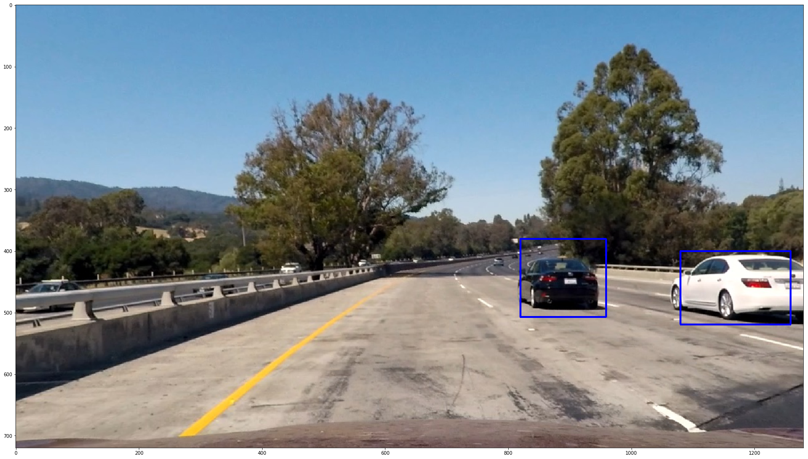
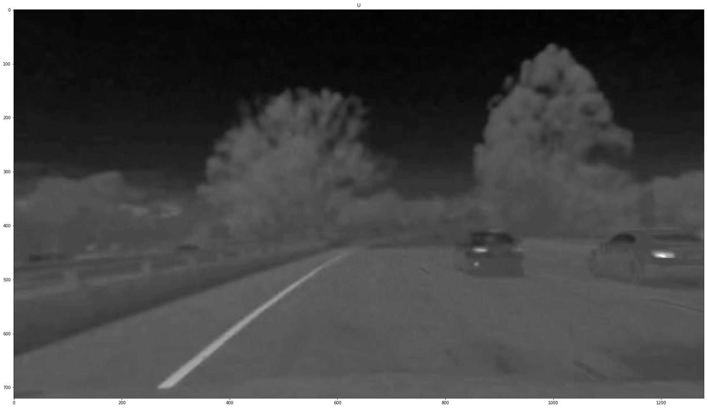
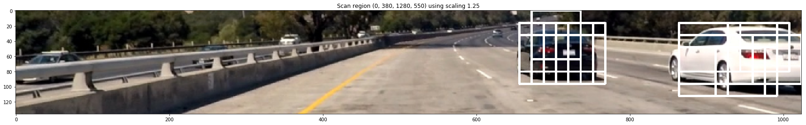

# Vehicle Detection
### Project 5 of Udacity's Self-Driving Car Engineer Nanodegree

###The goals / steps of this project are the following:

* Perform a Histogram of Oriented Gradients (HOG) feature extraction on a labeled training set of images and train a classifier
* Optionally, you can also apply a color transform and append binned color features, as well as histograms of color, to your HOG feature vector. 
* Note: for those first two steps don't forget to normalize your features and randomize a selection for training and testing.
* Implement a sliding-window technique and use your trained classifier to search for vehicles in images.
* Run your pipeline on a video stream (start with the test_video.mp4 and later implement on full project_video.mp4) and create a heat map of recurring detections frame by frame to reject outliers and follow detected vehicles.
* Estimate a bounding box for vehicles detected.

## [Rubric](https://review.udacity.com/#!/rubrics/513/view) Points
### Here I will consider the rubric points individually and describe how I addressed each point in my implementation.  

---
### Writeup / README

#### Submission contents:

* **Object_Classifier.py** - The object classifier can be trained with a two lists of image filenames containing positive (to be predicted with 1.0) and negative examples (to be predicted with 0.0). It first converts each image into a history of oriented gradients, short hod and then classifies them with either an SVM or a neural network.
* **Object\_Finder.py** - Uses an object classifier to scan through an image using a sliding window and to collect a list of regions which likely contain an object of the trained class
* **Hog\_Me.py** - Converts an RGB image to a HOG feature array. It also provides functions to select parts of a large image and extract features of a specific sub region.
* **Heater.py** - The heater combines all potential detections of the Object_Finder to compute a heat map of all hits of the current and the previous frames to remove false positives and slightly smoothen the detections between multiple input frames.
* **Vehicle\_Video\_Creator.py** - Is responsible for connecting all of the components above to convert a single input frame to an output frame highlighting the detected vehicles.
* **Vehicle\_Trainer.py** - Is a project specific class which trains an Object_Classifier using the vehicle images provided for this project.
* **Create\_Project\_Video.py** - Creates the final output video of this project.
* **Train\_Classifier.py** - Calibrates the camera using the chessboard images of project 4 and trains the vehicle classifier. Only needs to be called once and then stores the data in pickle files.
* **project\_video.mp4** - The project video provided by Udacity in which the vehicles shall be detected
* **test_video.mp4** - Just a very short version of the project video
* **images/*** - Images which are part of this documentation
* **test\_videos\_output/result.mp4** - The final result video
* **write.up** - You are reading it :)

All files of project 4 are required and provided as well and provide the image undistortion and lane detection functions.	
 
### Histogram of Oriented Gradients (HOG)

#### 1. Explain how (and identify where in your code) you extracted HOG features from the training images.

As proposed I used SciKit image's feature.hog method which requires a single channel image and converts this image into a list of usually 9 orientation gradients.

**How does HOG work?:**

* It divides an image into a list of cells - in our case cells with a size of 16x16 pixels each, a size of 8x8 are very common though.
* For each of these divided cells the color gradient is calculated for a set of given orientations. 12 orientations are used in our case, 9 is quite common, which would mean 180°/9 = 20° per step. For each of these orientations the intensity is calculated and stored in one of the histograms buckets for each cell.
* Then a set of mostly 2x2 cells builds a block. These blocks do overlap mostly, so block 1 for example shared the right cells of block 0. Each block contains different values for each cell it contains though as each block is normalized by itself. To reconstruct a cell all blocks of this cell are usually summed up and then scaled down again by the count of contributing blocks.

Our training images have a size of 64 by 64 pixels and I decided to use a cell size of 16 pixels.

This results in the following size of overall features:

* 64x64 pixels
   * 4x4 cells, 16x16 each
   * 2x2 cells per block = 3x3 blocks 
       * (as column 2 reaches to the right to col/row 3)
    * 3 blocks x 3 blocks x 4 cells per block x 12 orientations per block = 432
    * For 3 different color channels, summing up to 432*2 = 1296 overall features.

I decided to use the YUV color format consisting of luminance Y and chrominance U and V.

I think in this as in the previous project the most important factor is the light contrast within the image, so the differences between YUV, HLS or similar formats which separate the light intensity work comparable well.

Below you can see what the HOG converter and so the classifier in the end do see before the conversion:

You can find the code for the RGB to HOG conversion in Hog\_Me.py and the code for the classifier itself in Object\_Classifier.py.

#### 2. Explain how you settled on your final choice of HOG parameters.

I started with the proposed and also in the original article often mentioned setting of 8x8 pixels per cell, 9 orientations and 2x2 blocks.

I experimented with several combinations and ended up with 16 by 16 pixels instead of 8 by 8 but there for 12 orientations instead of 9 which let the classifier think a little bit more **global** because of it's larger cell size but also a bit more fine at orientations.

The result was a prediction accuracy of > 99% in the final classifier and also very less false positive detections in the project video.

The result of the Y (luminance) channel you can see below:

#### 3. Describe how (and identify where in your code) you trained a classifier using your selected HOG features (and color features if you used them).

The class which is responible for this in my code is Object\_Classifier in Object\_Classifier.py.

It is created using a Hoggit object, in which the details for the image to hog conversion are specified.

In the function **train** which requires a list of positive and negative examples it at first converts all of the images provided in the list from RGB to theirs representations of 1296 HOG features and stores the results in two lists of positive and negative samples.

For these two lists another two 1-dimensional lists are created of the same size, one containing **1s** (as we want the cars to be predicted of 1.0) and one of **0s** (for everything else).

The feature\_lists (X) and the label\_lists (y) are first of all concated to one feature and one label list, then randomly sorted and then split using scikit's function **train\_test\_split** to create a random orderd training set X\_train along with it's labels y\_train as well as a testing set X\_test and it's labels y\_test.

The training set is then normalized via scikit's StandardScaler class which centers is trained using the whole training set, so it's centered around a zero mean and using a standard deviation and can then be applied to all other examples such as the testing set and later the sliding window's current content.

*Note: The formular above was 1.0 - prediction*

The prepared training set can then either be passed into a linear support vector machine, in our case LinearSCV() by setting the Object\_Classifier's use\_svm flag to true. This reaches a testing accuracy of 97%. Alternatively a neural network can be trained reaching a far higher accuracy of about 99%, so just a 1% average error vs the 3% error of the SVM.
For the neural network variant the class MLPClassifier is used with a simple 3-layer neural network of 100 neurons and relua activation.

### Sliding Window Search

#### 1. Describe how (and identify where in your code) you implemented a sliding window search.  How did you decide what scales to search and how much to overlap windows?

In my very first approach I at first split the input image into several (overlapping sub images). These images I enlarged then (by factor 1.25 to 2.0) and then extracted the hog features of a 64x64 region of these images. It worked quite well, but was terrible slow, it took nearly one hour to convert the whole video once.

In my final approach which you can find in the files Object\_Finder.py and Hog\_Me.py I first of all cleanly divided the scene into 5 relevant regions of the 1280x720 input image:

* Scaling: 1.0, Region: (200, 380, 1000, 500)
* Scaling: 1.25, Region: (0, 380, 1280, 550)
* Scaling: 1.5, Region: (0, 380, 1280, 550)
* Scaling: 1.75, Region: (0, 380, 1280, 550)
* Scaling: 2.0, Region: (0, 380, 1280, 650)

For each scaling factor a resized copy of the defined region of the original image is created. Note that the scaling defines the scaling of the sliding window size for which the original image needs to be shrinked. So a sliding window scaling of 2.0 would result (in case of the last image) result in an image size of 640x135.

Each of these images is the converted to a HOG feature list. After the conversion **every** block (extended to a overall size of 64x64 pixels by 2x2 blocks) is then extracted from the full image feature list using the iterator function Hog\_Me.hog\_scan, resulting a 3x3 blocks plus theirs coordinate in the original image.

If the previously trained vehicle classifier then classifies the current 3x3 blocks as vehicle the region is remembed in a region list. (but not yet flagged as real vehicle):

#### 2. What did you do to optimize the performance of your classifier?

Increasing the cell size to 16 by 16 pixels and just converting the original image once per scaling to a hog feature list and then just still extracting the required region increased the performance dramatically. Also I switched from a single channel HLS color conversion using only the H channel to a 3-channel YUV variant.

This also made it possible to use far finer sliding window steppings which in result feelable increased the detection accuracy and reduction of false positives.

### Video Implementation

#### 1. Provide a link to your final video output.  Your pipeline should perform reasonably well on the entire project video (somewhat wobbly or unstable bounding boxes are ok as long as you are identifying the vehicles most of the time with minimal false positives.)

You can find the final result video here: [test\_videos\_output/result.mp4](test_videos_output/result.mp4)

#### 2. Describe how (and identify where in your code) you implemented some kind of filter for false positives and some method for combining overlapping bounding boxes.

You can find the code in the files Object_Finder.py and Heater.py.

As already mentioned above the object finder collects a list of regions where the objects to find are likely positioned.

These regions are then fed into the Heater class which collects images of multiple, consecutive frames and builds a heat map:

To this heat map at first a general threshhold is applied to remove the most obvious, very low rated instances (with less detection overlaps).

Then sklearn's label function is used to collect all remaining, potential instances which survived the treshholding.

In very rare cases some instaces also survived this step, but the heater also knows how large a vehicle in a specific should likely be and filters out all hits which do not fulfill this requirement:

* At least 150x150 pixels if the wheels are below 600
* At least 110x110 pixels if the wheels are below 550
* At least 90x90 pixels if the wheels are below 500
* At least 70x70 pixels if the wheels are below 480
* At least 50x50 pixels if the wheels are below 450

The closer the vehicle is to the camera the larger it should be most likely. ;)

After all these steps only regions remain which are very very likely part of a vehicle and shown below:

---

### Discussion

#### 1. Briefly discuss any problems / issues you faced in your implementation of this project.  Where will your pipeline likely fail?  What could you do to make it more robust?

The pipeline or in general the hog feature extractor using the images provided has a little affection for other "hard", "technical" edges such as the lane lines or steet signs. They could be filtered our with other tests, but it took a lot amount of time to filter these out in all situations.

I spent a lot of time on the extraction of hog features, the try to backconvert the hog features into an image and to tune all parameters to reduce the amount of false positives.

Using a convolutional neural network instead of building a heat map of guesses would likely increase the accuracy a lot. Another good approach would likely be to augment the set of 8000 images using rotations next to the already implemented mirroring.

