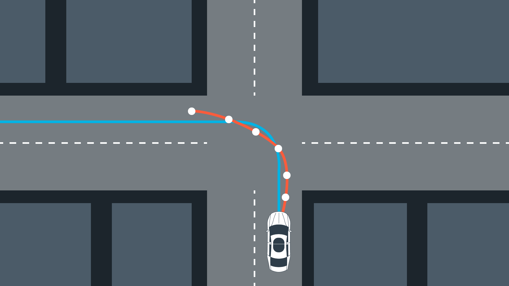

# Model Predictive Control - Project 10
***Udacity Self-Driving Car Engineer Nanodegree Program capstone project of term 2***

---

[](https://www.youtube.com/watch?v=OQ3YNYTQ7DE&t=48s)

\>>> A short clip on [YouTube](https://www.youtube.com/watch?v=OQ3YNYTQ7DE) <<<

---

## Overview

In this project the task was to control a virtual Self-Driving Car on a race track which automatically follows a set of predefined waypoints obtained from an imaginery sensor fusion system as perfectly as possible while being limited by a set of constraints such as a limited steering angle and a cost function trying to keep an optimal speed of 90 km/h in my test scenario.

In difference to a PID Controller (Proportional Integral Differential) a Model Predictive Control system is optimized for not just reacting to concrete, current situations but also to predict the effect of latency and how the car could and would react in future steps given the constraints such as the mentioned limited steering angles and with respect to the costs defined.

## The workflow

### Step 1: Receiving data from the client (sensor fusion unit)

In the first we we receive the current status from the imaginary sensor fusion unit which knows the vehicles current position, orientation as well as the map data relevant for the next planning steps. 

**This observation data contains:**

* Nearby waypoints (following up) (ptsx/ptsy)
* The car's location (x/y)
* The car's orientation (psi)
* The current steering angle
* The current throttle (a value between -1 and 1)
* The current speed in mph

The map data provided to us by this unit is absolute so we first of all need to convert it into our local space (into the sight of the driver) so all follow up calculations can be done relative to the car and independent of the real world position and orientation.

### Step 2: Fitting a polynomial

In the second step we fit a polynomial which "describes" the relative, optimal line.

### Step 3: Calculation of the initial error values

With help of the now localized data we can calculate the cross track error (CTE) of this polynomial and the initial orientation error (eps).

### Step 4: Predicting the latency

As we need to assume at least a minimal latency between our actual decisions and the application of our decisions we now predict how our states will likely look in 100ms:

```
const double dt = 0.1;
const double Lf = 2.67;

double next_x = v * dt;
double next_y = 0;
double next_psi = v * -delta / Lf * dt;
double next_v = v + a * dt;
double next_cte = cte + v * sin(eps) * dt;
double next_eps = eps + -delta / Lf * dt;
```

### Step 5: Defining the prediciton range

In the next step (within our MPC class) we now define how far we predict into the future and with which interval.

I chose here a value of 10 time steps and an interval of 0.08 seconds.

I tried several other values for N such as an N of 20 with an interval of 0.05 as well as 0.1.

**My observations:**

* Planning too far into the future (above 2 seconds, such as N of 20 and dt of 0.1) (just increase N while keeping dt) will heavily destabalize the driving behavior, majorly if the car is approaching some sort of S-like curve
* Using a far too small value for dt (such as 0.05) will as well lead to a more oscillating driving behavior
* Using a horizont of about 1 second turned out to be optimal and is at a speed of around 80 km/h enough time to predict the route through a complete curve of this test track

### Steps 6: Definition of the cost functions for potential solutions of the problem

In step 6 we define the cost function `FG_eval.operator()(ADvector& fg, const ADvector& vars)` which is regularly called by the solver itself to compute the costs for the usage of actuators, the cross track and orientation error as the prediction gaps.

It does this for each of our N defined time steps and calculates the state variables for each of these 9 steps (the 10th is the initial one at zero) using the following formulas and then calculates the offset to the initial state value:


These cost factors and values for each time step are provided to the `Solve` function on demand. (the object is passed to ipopt and calls the operator defined)

### Steps 7: Let's solve this

In this penultimate step we make use of the libraries **CppAD** and **ipopt** to minimize the costs computed by our function defined in step 6.

The ultimate goal of the function `CppAD::ipopt::solve` is to minimize the costs within the time horizont we previously defined or in other words to calculate **the optimal curve** (the red line below) which will get us back to the "perfect" center of the road (the blue line below which can though not be driven as displayd because of it's small curve radius) with an as small orientation offset as possible while at the same timing making as less use of the actuators as possible.


*Image (C) Udacity*

### Step 8: Back to the bridge

After this likely optimal curve and it's initial actuator values have been calculated we return the curve itself as the optimal actuation values to the interface function.

The interface function which has been triggered now stores all data available in a JSON package which is returned to the server:

* The likely optimal steering & throttle values
* The reference line
* The predicted trajectory

A video of the driving behavior can be found here:

[https://www.youtube.com/watch?v=OQ3YNYTQ7DE](https://www.youtube.com/watch?v=OQ3YNYTQ7DE)

---

## Appendix

If you would like to try this project out yourself you can find the installation guide [here](setup.md).

#### Important note:

An OS X setup is quite tricky at the momen so I recommend using either Linux or the Ubuntu subsystem in Windows.

If you intend to use the Ubuntu subsystem in Windows you need to take care that you clone this repository from the Ubuntu bash as otherwise the line-endings will be converted by Git for Windows making all shell scripts invalid.