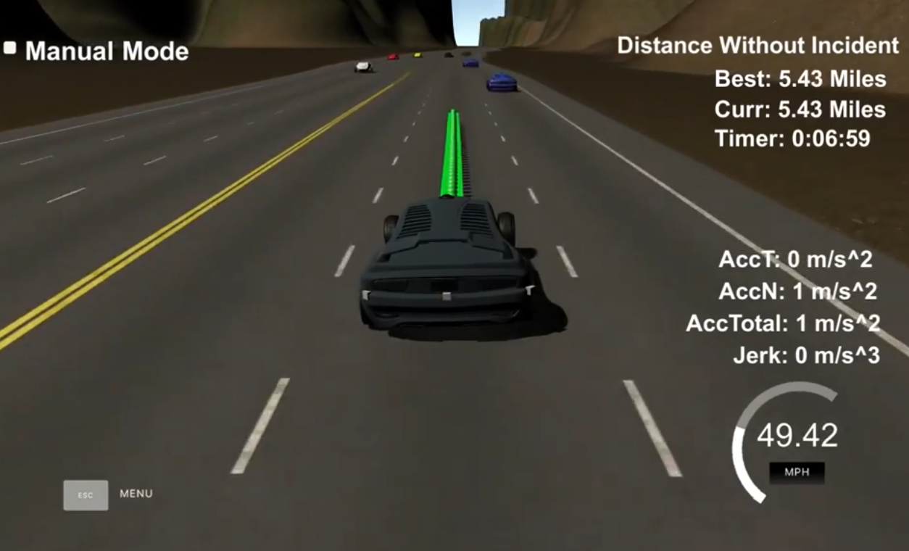
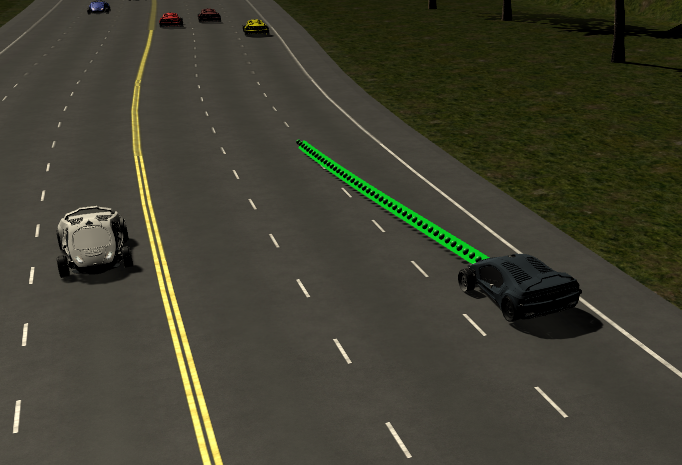
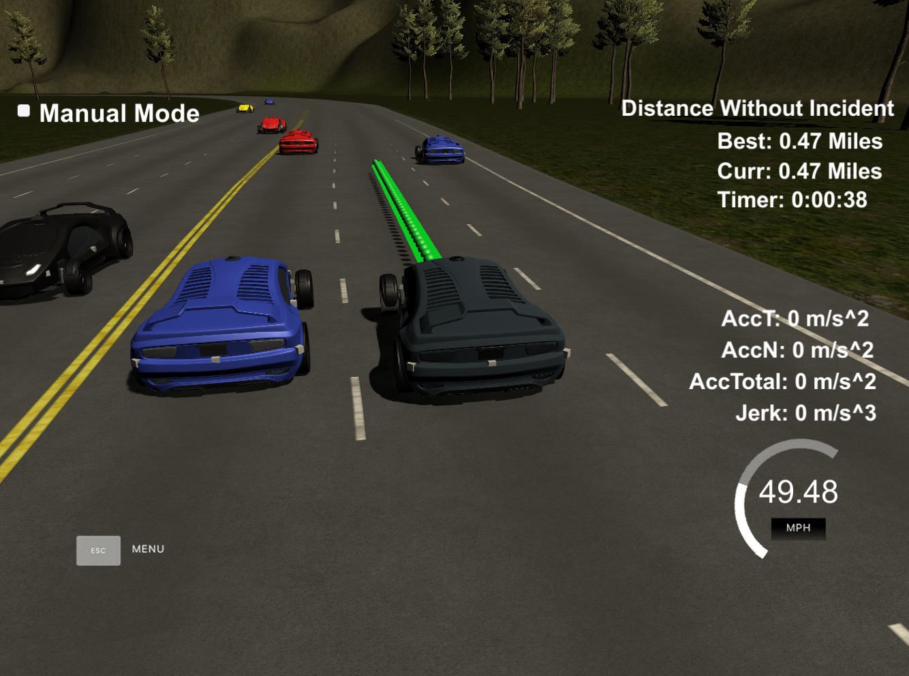
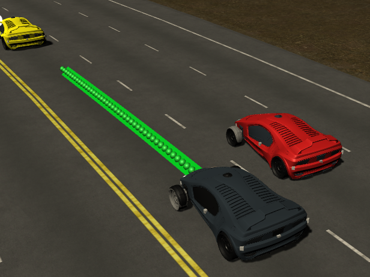
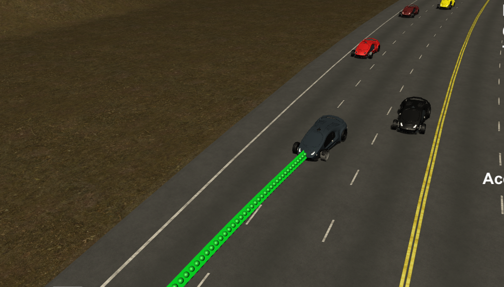

# Highway Path Plannning

#### Project 11 of Udacity's Self-Driving Car Engineer Nanodegree Program

[](https://www.youtube.com/watch?v=BzFJcJm_7Ko)
[https://www.youtube.com/watch?v=BzFJcJm_7Ko](https://www.youtube.com/watch?v=BzFJcJm_7Ko)

---

## Overview

The task of this project was to develop a control system for a Self-Driving Car which steers it safely along a highway within dense traffic, predicts the other car's behaviors, keeps a safe braking distance and overtakes other vehicles as safely as possible while always taking care of producing no unpleasant jerk or acceleration in general.

## Tasks

### Building the project

The project was built using CLion using the CMakeFile provided by Udacity which can be easily imported. Alternatively the project can be build using the `./build.sh` script provided.
Before building the project the script `install-mac.sh` should be executed or alternatively `install-ubuntu.sh` in Windows or the Ubuntu bash. Important note for Windows users: All bash scripts need to be pulled from Git in the Ubuntu-bash as they are not line break tolerant.

## Rubrics

#### The car is able to drive at least 4.32 miles without incident..

The car (as recorded in the [YouTube video](https://www.youtube.com/watch?v=BzFJcJm_7Ko)) drives more than 5 miles (and likely till the fuel is out if nobody would stop it :).

#### The car drives according to the speed limit.

The car has a preset maximum speed of 49.5 miles per hour which it keeps constantly as long as there is no vehicle in it's way where it decelerates to keep a safe braking distance.

#### Max Acceleration and Jerk are not Exceeded.

The acceleration never exceeds 5 m/sˆ2 and the jerk is neglicible. This was realized by computing very smooth splines as proposed in the Q&A session.

#### Car does not have collisions.

The car didn't ever collide with any other cars within a 50 minute simulation. It predicts cars at front as well as estimating how fast another car "will reach us" on neighbour lanes to compute the lane change costs.

#### The car stays in its lane, except for the time between changing lanes.

The car stays constantly within it's lane. Next to the pure overtaking mechanism I also added another one which makes driving in the right lanes the more attractive the longer it is driving in one of the right ones.

#### The car is able to change lanes

The car smoothly changes lanes and also never changes more than one lane in one step. It does so by computing costs for each lane which are a combination of the likely speed in one of the neighbour lanes, how dangerous it is likely to move into this lane, how "left" the lane is (it prefers right ones if all lanes are empty).



---

## Reflection

The paths are computed 50 times a second so with an interval of 0.02 seconds.

At each time interval following data is provided to the control unit (the one we wrote):

* The remaining points of the current trajectory (if one was planned before)
* The vehicle's position in cartesian as well as Frenet coordinates as well as it's speed.
* The locations of all vehicles around us (on our sides of the highway)

Also we know all road elements of the highway track and that each lane has a width of 4 meters.

### Step 1: What to do? (Planning)

Right after receiving the newest data update the first two values the logic unit computes are:

* The target lane
* The optimum speed in the current lane(s)



#### The target lane

To decide which lane is currently the "most attractive one" the costs for each of the 3 lanes is computed as follows:

* The base value for these costs is the squared side movement distance squared
* Non neighbouring lanes are blocked (too dangerous - better step by step)
* How fast we could likely move within the lane / how close we were to another vehicle in front of us in this lane (costs up to 35 if we are right behind another car)
* How likely it is that we would collide with another car when switching lanes (theirs distance to us and theirs speed vs our speed). A 20 meter safety corridor is computed which may neither be intersected nor reached within a given time frame.
* How long do we (unnecessarily) stay in one of the left lanes. There is a penalty base value and a penalty counter which makes a lane change from left to right more attactive within a time horizont of 10-20 seconds, assuming the right neighbour lane is as empty as the current one.

### The speed

To compute the speed the system first of all checks in which lanes the vehicle is currently located. If the car is currently transitioning from one lane to another and the offset from the lane's center exceeds a given threshold the current and the target lane into account.

Then the safe-braking distance is calculated via `(speed/10)^2 + speed/10*3` and the current speed is adjusted if another vehicle is right in front of us in one of these lanes.

The slower the vehicle is the less far it looks forward as the braking distance decreases in consequence.



### Step 2: Calculation of the trajectory

After the planning is finished we create a spline defining the future trajectory, to do so we first of all need to define a set of anchors points.

The first anchor points of this spline are either the most recent points (behind us) of the last defined trajectory or alternatively a back projected line computed with help of the car's known yaw.

To these anchor points we now compute 3 additional ones far in front of us (in the future) in the target lane.

To receive a clean, zero based X/Y graph we now transform all anchors points into the car local's coordinate system by translating and back rotating them by the car's location and yaw. Afterwards we compute a spline using these 5 anchor points which defines a smooth, jerkless transition from the most recent movements/the current direction to the desired target location and direction. Herefor we use the spline library by Tino Kluge.

After the spline is computed we now first of all store the remaining, not yet reached points of the last trajectory and extend the queue to 50 elements with the points along the just computed spline and spaced by a 1/50th of the current speed so the simulator knows how fast to drive.



Now we transform the just computed, updated 50 trajectory points back into the global, carthesian coordinate system, store it in a json object and send this json object back to the simulator.

### The code

The whole logic is kept in the single file `main.cpp` and implemented in the central class `PathPlanner`.

**PathPlanner** defines the following functions:

* SetFrameData - Receives pointers and references to all data available. Is called every frame.
* CalculateTrajectory - Triggers the whole logic and returns the 50 trajectory coordinates
* CalculateLaneCosts - Calculates the costs for each lane, taking potential collisions, likely drivable speeds, required lane changes and also the lanes position (right lanes preferred) into account.
* GetCurrentLane - Returns the current lane's index
* GetLaneOffset - Returns the current offset to the lane's center
* ChooseTargetLane - Chooses a new target lane. If another lane can be safely entered and promises a higher speed it is chosen. Also (with a 10 second cooldown) a more right lane is chosen above a more left one if all lanes are empty.
* CalculateSafetyDistance - Calculates the minimum distance required to a car in front of us for a safe, smooth braking maneuver.
* CheckDistances - Checks the distance to cars in front of us in our current and/or (if switching) of the target lane, brakes if necessary or accelerates again if possible.

---

# Project setup

... in case you want to try this project yourself :).
   
### Simulator.
You can download the Term3 Simulator which contains the Path Planning Project from the [releases tab (https://github.com/udacity/self-driving-car-sim/releases/tag/T3_v1.2).

### Goals
In this project your goal is to safely navigate around a virtual highway with other traffic that is driving +-10 MPH of the 50 MPH speed limit. You will be provided the car's localization and sensor fusion data, there is also a sparse map list of waypoints around the highway. The car should try to go as close as possible to the 50 MPH speed limit, which means passing slower traffic when possible, note that other cars will try to change lanes too. The car should avoid hitting other cars at all cost as well as driving inside of the marked road lanes at all times, unless going from one lane to another. The car should be able to make one complete loop around the 6946m highway. Since the car is trying to go 50 MPH, it should take a little over 5 minutes to complete 1 loop. Also the car should not experience total acceleration over 10 m/s^2 and jerk that is greater than 10 m/s^3.

#### The map of the highway is in data/highway_map.txt
Each waypoint in the list contains  [x,y,s,dx,dy] values. x and y are the waypoint's map coordinate position, the s value is the distance along the road to get to that waypoint in meters, the dx and dy values define the unit normal vector pointing outward of the highway loop.

The highway's waypoints loop around so the frenet s value, distance along the road, goes from 0 to 6945.554.

## Basic Build Instructions

1. Clone this repo.
2. Make a build directory: `mkdir build && cd build`
3. Compile: `cmake .. && make`
4. Run it: `./path_planning`.

Here is the data provided from the Simulator to the C++ Program

#### Main car's localization Data (No Noise)

["x"] The car's x position in map coordinates

["y"] The car's y position in map coordinates

["s"] The car's s position in frenet coordinates

["d"] The car's d position in frenet coordinates

["yaw"] The car's yaw angle in the map

["speed"] The car's speed in MPH

#### Previous path data given to the Planner

//Note: Return the previous list but with processed points removed, can be a nice tool to show how far along
the path has processed since last time. 

["previous_path_x"] The previous list of x points previously given to the simulator

["previous_path_y"] The previous list of y points previously given to the simulator

#### Previous path's end s and d values 

["end_path_s"] The previous list's last point's frenet s value

["end_path_d"] The previous list's last point's frenet d value

#### Sensor Fusion Data, a list of all other car's attributes on the same side of the road. (No Noise)

["sensor_fusion"] A 2d vector of cars and then that car's [car's unique ID, car's x position in map coordinates, car's y position in map coordinates, car's x velocity in m/s, car's y velocity in m/s, car's s position in frenet coordinates, car's d position in frenet coordinates. 

## Details

1. The car uses a perfect controller and will visit every (x,y) point it recieves in the list every .02 seconds. The units for the (x,y) points are in meters and the spacing of the points determines the speed of the car. The vector going from a point to the next point in the list dictates the angle of the car. Acceleration both in the tangential and normal directions is measured along with the jerk, the rate of change of total Acceleration. The (x,y) point paths that the planner recieves should not have a total acceleration that goes over 10 m/s^2, also the jerk should not go over 50 m/s^3. (NOTE: As this is BETA, these requirements might change. Also currently jerk is over a .02 second interval, it would probably be better to average total acceleration over 1 second and measure jerk from that.

2. There will be some latency between the simulator running and the path planner returning a path, with optimized code usually its not very long maybe just 1-3 time steps. During this delay the simulator will continue using points that it was last given, because of this its a good idea to store the last points you have used so you can have a smooth transition. previous_path_x, and previous_path_y can be helpful for this transition since they show the last points given to the simulator controller with the processed points already removed. You would either return a path that extends this previous path or make sure to create a new path that has a smooth transition with this last path.

## Tips

A really helpful resource for doing this project and creating smooth trajectories was using http://kluge.in-chemnitz.de/opensource/spline/, the spline function is in a single hearder file is really easy to use.

---

## Dependencies

* cmake >= 3.5
  * All OSes: [click here for installation instructions](https://cmake.org/install/)
* make >= 4.1
  * Linux: make is installed by default on most Linux distros
  * Mac: [install Xcode command line tools to get make](https://developer.apple.com/xcode/features/)
  * Windows: [Click here for installation instructions](http://gnuwin32.sourceforge.net/packages/make.htm)
* gcc/g++ >= 5.4
  * Linux: gcc / g++ is installed by default on most Linux distros
  * Mac: same deal as make - [install Xcode command line tools]((https://developer.apple.com/xcode/features/)
  * Windows: recommend using [MinGW](http://www.mingw.org/)
* [uWebSockets](https://github.com/uWebSockets/uWebSockets)
  * Run either `install-mac.sh` or `install-ubuntu.sh`.
  * If you install from source, checkout to commit `e94b6e1`, i.e.
    ```
    git clone https://github.com/uWebSockets/uWebSockets 
    cd uWebSockets
    git checkout e94b6e1
    ```

## Editor Settings

We've purposefully kept editor configuration files out of this repo in order to
keep it as simple and environment agnostic as possible. However, we recommend
using the following settings:

* indent using spaces
* set tab width to 2 spaces (keeps the matrices in source code aligned)

## Code Style

Please (do your best to) stick to [Google's C++ style guide](https://google.github.io/styleguide/cppguide.html).

## Project Instructions and Rubric

Note: regardless of the changes you make, your project must be buildable using
cmake and make!


## Call for IDE Profiles Pull Requests

Help your fellow students!

We decided to create Makefiles with cmake to keep this project as platform
agnostic as possible. Similarly, we omitted IDE profiles in order to ensure
that students don't feel pressured to use one IDE or another.

However! I'd love to help people get up and running with their IDEs of choice.
If you've created a profile for an IDE that you think other students would
appreciate, we'd love to have you add the requisite profile files and
instructions to ide_profiles/. For example if you wanted to add a VS Code
profile, you'd add:

* /ide_profiles/vscode/.vscode
* /ide_profiles/vscode/README.md

The README should explain what the profile does, how to take advantage of it,
and how to install it.

Frankly, I've never been involved in a project with multiple IDE profiles
before. I believe the best way to handle this would be to keep them out of the
repo root to avoid clutter. My expectation is that most profiles will include
instructions to copy files to a new location to get picked up by the IDE, but
that's just a guess.

One last note here: regardless of the IDE used, every submitted project must
still be compilable with cmake and make./
